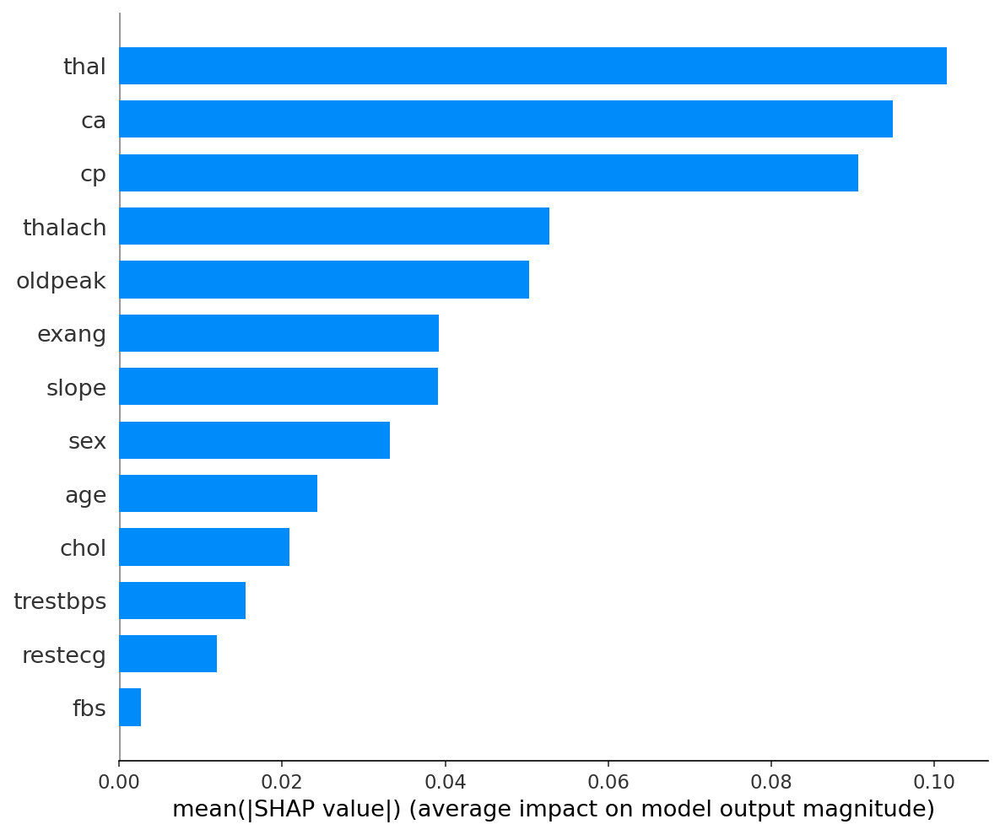
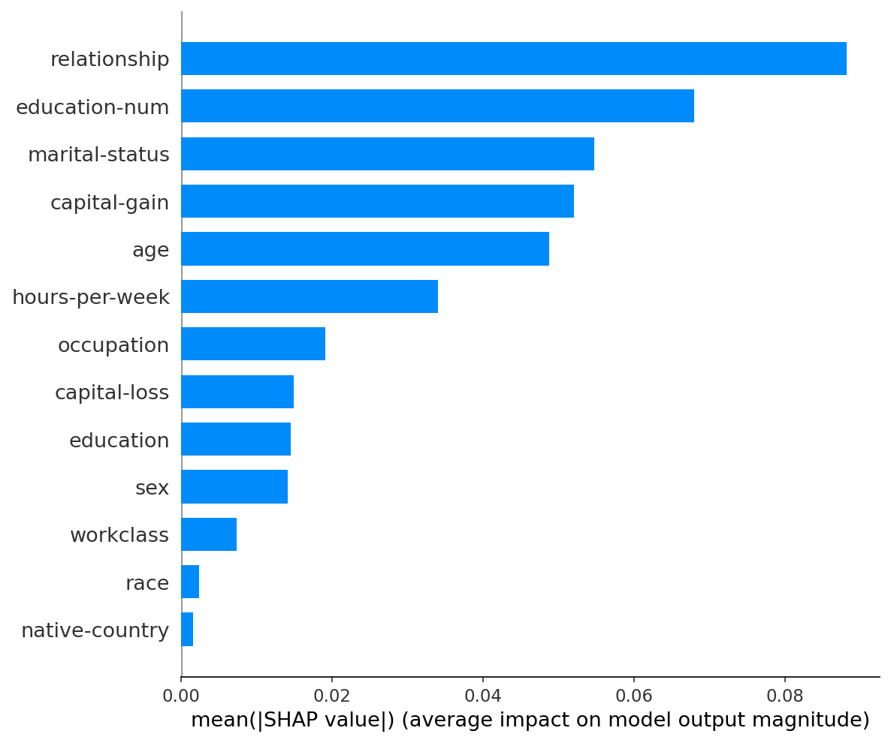
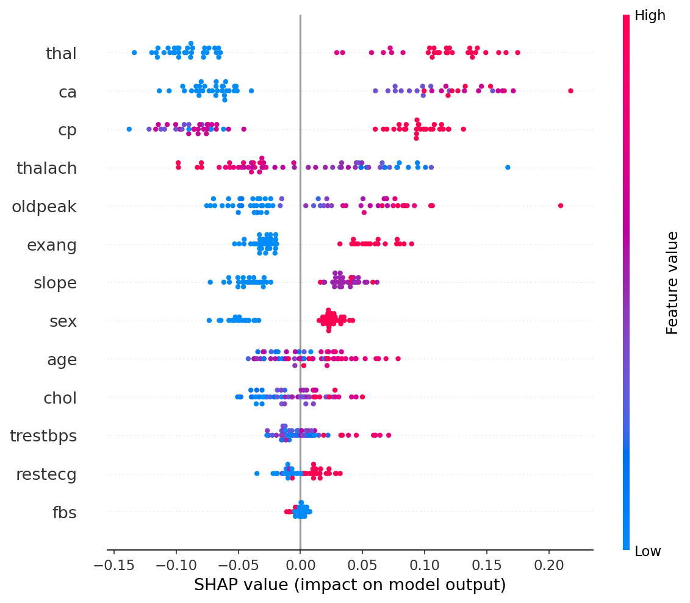
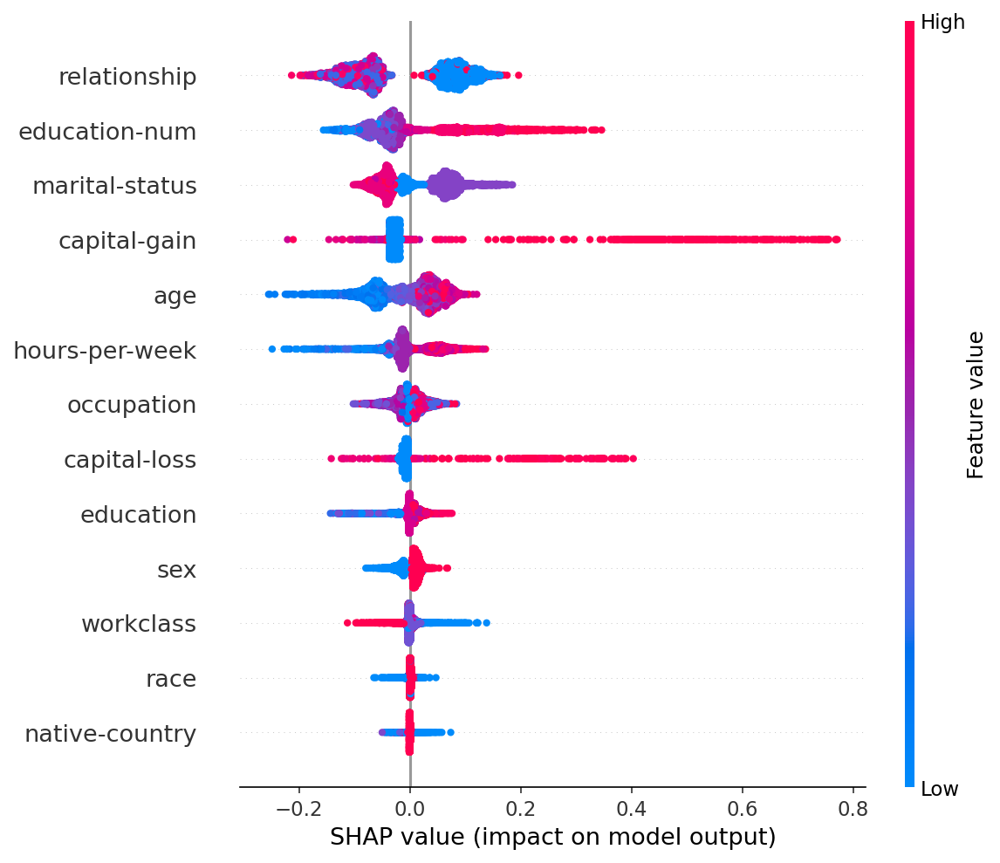
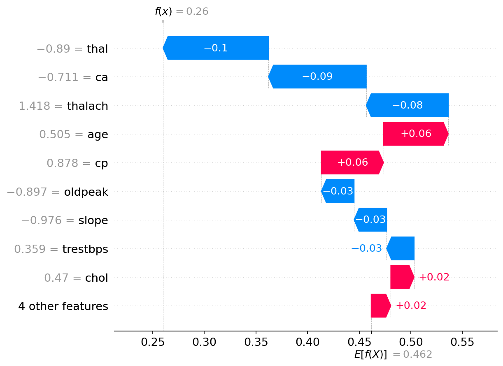
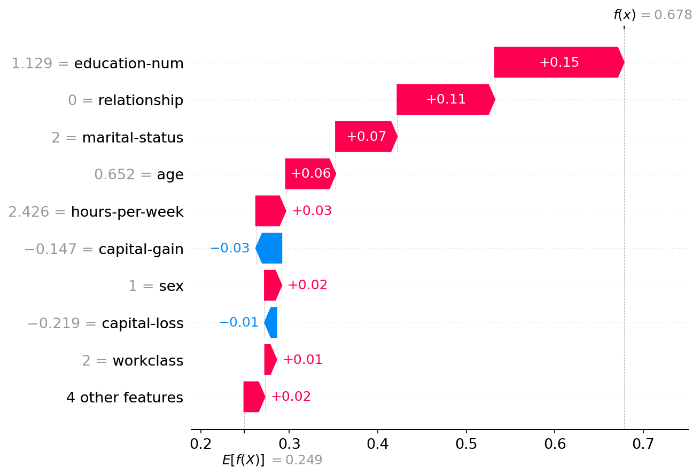

<div align="center">

# XAI Medical Decision Support System

### Multi-Model Explainable AI with SHAP · Fairness Analysis · Interactive Dashboard

[](https://www.python.org/)
[](https://scikit-learn.org/)
[](https://shap.readthedocs.io/)
[](https://fastapi.tiangolo.com/)
[](https://streamlit.io/)
[](LICENSE)

*A semester research project — Department of Artificial Intelligence, 2026*

</div>

---

## Overview

Black-box machine learning models increasingly influence high-stakes decisions in healthcare and socioeconomics — yet most cannot explain *why* they made a prediction. This project builds a complete **Explainable AI (XAI) system** that:

- Trains **4 ML models** on 2 real-world datasets
- Applies **SHAP (SHapley Additive Explanations)** to produce consistent global and local explanations for every model
- Runs a **fairness audit** measuring demographic parity, equal opportunity, and disparate impact across sex, race, and age groups
- Serves everything through a **FastAPI backend** and **Streamlit dashboard**

> **Why SHAP?** Unlike simpler importance scores, SHAP values are grounded in cooperative game theory — they are the only method guaranteed to satisfy consistency, local accuracy, and missingness simultaneously (Lundberg & Lee, 2017).

---

## Table of Contents

- [System Architecture](#system-architecture)
- [Datasets](#datasets)
- [Models & Results](#models--results)
- [SHAP Explainability](#shap-explainability)
- [Fairness Analysis](#fairness-analysis)
- [Getting Started](#getting-started)
- [Running Each Module](#running-each-module)
- [Project Structure](#project-structure)
- [Team](#team)
- [References](#references)

---

## System Architecture

```
┌──────────────────────────────────────────────────────┐
│                    Input Datasets                    │
│         Heart Disease (UCI)  │  Adult Income (UCI)   │
└──────────────────┬───────────────────────┬───────────┘
                   │                       │
        ┌──────────▼───────────────────────▼──────────┐
        │            Preprocessing Pipeline            │
        │       Clean  →  Encode  →  Scale  →  Split  │
        └─────────────────────┬───────────────────────┘
                              │
        ┌─────────────────────▼───────────────────────┐
        │               Model Training                 │
        │   Logistic Regression  │  Decision Tree      │
        │   Random Forest        │  Neural Network     │
        └──────────┬──────────────────────┬────────────┘
                   │                      │
       ┌───────────▼──────┐    ┌──────────▼───────────┐
       │  SHAP Explainer  │    │   Fairness Analyzer  │
       │  · Summary plot  │    │  · Demographic parity│
       │  · Bar chart     │    │  · Equal opportunity │
       │  · Waterfall     │    │  · Disparate impact  │
       │  · Dependence    │    └──────────┬───────────┘
       └───────────┬──────┘               │
                   └──────────┬───────────┘
                              │
              ┌───────────────▼──────────────────┐
              │      FastAPI  +  Streamlit UI     │
              │  Prediction · Explanation · Audit │
              └──────────────────────────────────┘
```

---

## Datasets

| Dataset | Source | Task | Samples | Features | Sensitive Attributes |
|---|---|---|---|---|---|
| **Heart Disease** (UCI Cleveland) | [UCI ML Repository](https://archive.ics.uci.edu/ml/datasets/heart+disease) | Predict presence of heart disease (binary) | 303 | 13 | `sex`, `age` |
| **Adult Income** (UCI Census 1994) | [UCI ML Repository](https://archive.ics.uci.edu/ml/datasets/adult) | Predict income >$50K (binary) | 32,561 | 13 | `sex`, `race`, `age` |

<details>
<summary><b>Heart Disease — Feature Descriptions</b></summary>

| Feature | Description |
|---|---|
| `age` | Age in years |
| `sex` | Sex (1 = male, 0 = female) |
| `cp` | Chest pain type (0–3) |
| `trestbps` | Resting blood pressure (mm Hg) |
| `chol` | Serum cholesterol (mg/dl) |
| `fbs` | Fasting blood sugar > 120 mg/dl |
| `restecg` | Resting ECG results (0–2) |
| `thalach` | Maximum heart rate achieved |
| `exang` | Exercise-induced angina |
| `oldpeak` | ST depression induced by exercise |
| `slope` | Slope of peak exercise ST segment |
| `ca` | Number of major vessels (0–3) coloured by fluoroscopy |
| `thal` | Thalassemia type (1 = normal, 2 = fixed defect, 3 = reversible defect) |

</details>

<details>
<summary><b>Adult Income — Feature Descriptions</b></summary>

| Feature | Description |
|---|---|
| `age` | Age in years |
| `workclass` | Employment type (Private, Self-emp, Gov, etc.) |
| `education` | Highest education level |
| `education-num` | Education level as numeric |
| `marital-status` | Marital status |
| `occupation` | Job category |
| `relationship` | Relationship status |
| `race` | Race (White, Black, Asian-Pac-Islander, etc.) |
| `sex` | Sex (Male / Female) |
| `capital-gain` | Capital gains from investments |
| `capital-loss` | Capital losses |
| `hours-per-week` | Hours worked per week |
| `native-country` | Country of origin |

</details>

---

## Models & Results

Four classification algorithms are trained on each dataset using identical preprocessing and an 80/20 stratified train/test split.

### Heart Disease

| Model | Accuracy | AUC | F1 |
|---|---|---|---|
| Logistic Regression | 86.9% | 0.951 | 0.867 |
| Decision Tree | 72.1% | 0.729 | 0.730 |
| **Random Forest** | **90.2%** | **0.951** | **0.900** |
| Neural Network (MLP) | 83.6% | 0.931 | 0.844 |

### Adult Income

| Model | Accuracy | AUC | F1 |
|---|---|---|---|
| Logistic Regression | 81.8% | 0.850 | 0.547 |
| Decision Tree | 85.0% | 0.895 | 0.669 |
| **Random Forest** | **86.0%** | **0.915** | **0.689** |
| Neural Network (MLP) | 84.9% | 0.903 | 0.656 |

> Random Forest achieves the best performance on both datasets and is used as the primary model in the dashboard. All 4 models are fully explained via SHAP.

---

## SHAP Explainability

SHAP assigns each feature a value representing its contribution to a specific prediction, relative to the model's average output. Values are computed using three backends depending on model type:

| Model | SHAP Backend | Complexity |
|---|---|---|
| Random Forest, Decision Tree | `TreeExplainer` | Exact, fast |
| Logistic Regression | `LinearExplainer` | Exact, fast |
| Neural Network (MLP) | `KernelExplainer` | Approximate, ~2 min |

### Global Explanation — Feature Importance Bar Chart

Mean absolute SHAP values across the test set. Longer bar = higher average influence on predictions.

<table>
<tr>
<td align="center"><b>Heart Disease — Random Forest</b></td>
<td align="center"><b>Adult Income — Random Forest</b></td>
</tr>
<tr>
<td></td>
<td></td>
</tr>
</table>

**Heart Disease:** `thal` (thalassemia type) and `ca` (blocked vessels) dominate — consistent with clinical knowledge that these are the strongest predictors of heart disease.

**Adult Income:** `education-num` and `relationship` lead. The high rank of `relationship` (which encodes husband/wife) is a proxy for sex — a key finding for the fairness analysis.

---

### Global Explanation — Beeswarm Summary Plot

Each dot is one test sample. Position on the x-axis shows the SHAP value (positive = pushed toward predicting the positive class). Colour shows the raw feature value (red = high, blue = low).

<table>
<tr>
<td align="center"><b>Heart Disease — Random Forest</b></td>
<td align="center"><b>Adult Income — Random Forest</b></td>
</tr>
<tr>
<td></td>
<td></td>
</tr>
</table>

**Reading the plot:**
- `thal` — blue dots (low thal value) cluster on the right → low thalassemia type increases disease prediction
- `ca` — red dots (many blocked vessels) cluster right → more blocked vessels increases disease prediction
- `education-num` — red dots right → higher education strongly pushes toward >$50K prediction

---

### Local Explanation — Waterfall Plot

Explains a *single prediction*. Starting from the base value (average prediction), each feature's contribution is shown as a red (positive push) or blue (negative push) bar until the final prediction is reached.

<table>
<tr>
<td align="center"><b>Heart Disease — Sample Patient</b></td>
<td align="center"><b>Adult Income — Sample Record</b></td>
</tr>
<tr>
<td></td>
<td></td>
</tr>
</table>

This is the **local explanation** — it answers: *"For this specific patient, why did the model predict heart disease?"*

---

## Fairness Analysis

The fairness module evaluates whether model predictions are equitable across demographic groups using three standard metrics:

| Metric | Definition | Threshold |
|---|---|---|
| **Demographic Parity** | Positive prediction rate per group should be equal | Groups within 10% of each other |
| **Equal Opportunity** | True positive rate (recall) should be equal across groups | TPR gap < 10% |
| **Disparate Impact** | Ratio of lowest to highest positive rate | Value ≥ 0.8 considered fair (80% rule) |

**Sensitive attributes evaluated:**

| Dataset | Attributes |
|---|---|
| Heart Disease | `sex`, `age_group` (Young / Middle / Senior) |
| Adult Income | `sex`, `race`, `age_group` |

> **Expected finding:** Prior research shows the Adult Income dataset exhibits significant gender bias in income prediction (Becker & Kohavi, 1996). Males are predicted as >$50K earners at approximately 3× the rate of females even after controlling for education and hours worked. Our fairness module quantifies and visualises this disparity across all 4 models.

*Fairness analysis output: `reports/fairness/` (generated by `src/fairness/metrics.py`)*

---

## Getting Started

### Prerequisites

- Python 3.10+
- Git

### Installation

```bash
# 1. Clone the repository
git clone https://github.com/<your-username>/XAI.git
cd XAI

# 2. Create and activate a virtual environment
python -m venv venv
venv\Scripts\activate        # Windows
# source venv/bin/activate   # macOS / Linux

# 3. Install dependencies
pip install -r requirements.txt
```

### Data

Both datasets are included in the repository — no downloads required.

| Dataset | Path |
|---|---|
| Heart Disease | `data/heart_disease_data.csv` |
| Adult Income | `data/adult/adult.data` |

---

## Running Each Module

> **Always run from the project root** (`cd XAI`), not from inside subfolders.

### Phase 1 — Train Models

```bash
# Heart Disease (Rabiya)
python src/models/heart_disease/train.py

# Adult Income (Salman)
python src/models/adult/train.py
```

Trained models are saved to `saved_models/` as `.pkl` files following the convention:
```
saved_models/<dataset>_<model>.pkl
# e.g. saved_models/adult_random_forest.pkl
```

### Phase 2 — Generate SHAP Explanations

```bash
python src/explainability/run_shap.py
```

Generates 5 plots per model × 4 models × 2 datasets = **40 plots** in `reports/shap/`.

```
reports/shap/
├── heart_disease/
│   ├── random_forest_summary.png       ← global beeswarm
│   ├── random_forest_bar.png           ← global bar chart
│   ├── random_forest_waterfall.png     ← local instance explanation
│   └── random_forest_dependence_*.png  ← top-2 feature effects
└── adult/
    └── ...
```

### Phase 2 — Run Fairness Analysis

```bash
python src/fairness/metrics.py   # (after implementation)
```

### Phase 3 — Launch the Dashboard

```bash
# Terminal 1 — FastAPI backend
uvicorn src.api.main:app --reload
# Docs at: http://127.0.0.1:8000/docs

# Terminal 2 — Streamlit frontend
streamlit run dashboard/app.py
```

---

## Project Structure

```
XAI/
├── config.py                        # Central path and constant configuration
├── requirements.txt
├── data/
│   ├── heart_disease_data.csv       # Heart Disease dataset (303 rows)
│   └── adult/
│       └── adult.data               # Adult Income dataset (32,561 rows)
├── docs/
│   └── images/                      # README showcase images
├── notebooks/
│   ├── heart_disease_eda.ipynb      # Exploratory data analysis
│   └── adult_eda.ipynb
├── src/
│   ├── preprocessing/
│   │   ├── base.py                  # Abstract BasePreprocessor
│   │   ├── heart_disease.py         # Heart Disease pipeline
│   │   └── adult.py                 # Adult Income pipeline
│   ├── models/
│   │   ├── base.py                  # ModelTrainer (train, evaluate, save, plot)
│   │   ├── heart_disease/train.py   # Heart Disease training script
│   │   └── adult/train.py           # Adult Income training script
│   ├── explainability/
│   │   ├── shap_explainer.py        # SHAPExplainer class
│   │   └── run_shap.py              # Run SHAP on all models
│   ├── fairness/
│   │   └── metrics.py               # FairnessAnalyzer class
│   └── api/
│       └── main.py                  # FastAPI endpoints
├── dashboard/
│   └── app.py                       # Streamlit dashboard
├── saved_models/                    # Trained .pkl files (gitignored)
├── reports/
│   ├── shap/                        # SHAP plots (gitignored)
│   └── fairness/                    # Fairness charts (gitignored)
└── TEAM_INSTRUCTIONS.md             # Full workflow guide for contributors
```

---

## Team

<table>
<tr>
<td align="center" width="33%">
<b>Muhammad Ibrahim</b><br>
BSAI23046<br><br>
Repo setup · SHAP explainability<br>
<code>feature/ibrahim-shap</code>
</td>
<td align="center" width="33%">
<b>Rabiya Tahir</b><br>
BSAI23043<br><br>
Heart Disease pipeline · Fairness analysis<br>
<code>feature/rabiya-heart-disease</code>
</td>
<td align="center" width="33%">
<b>Salman Ali Khan</b><br>
BSAI23061<br><br>
Adult Income pipeline · API · Dashboard<br>
<code>feature/salman-adult</code>
</td>
</tr>
</table>

---

## References

1. **Lundberg, S. M., & Lee, S. I.** (2017). *A Unified Approach to Interpreting Model Predictions*. Advances in Neural Information Processing Systems (NeurIPS). — The original SHAP paper.

2. **Becker, B., & Kohavi, R.** (1996). *Adult Data Set*. UCI Machine Learning Repository. — Adult Income dataset.

3. **Detrano, R., et al.** (1989). *International application of a new probability algorithm for the diagnosis of coronary artery disease*. American Journal of Cardiology. — Heart Disease dataset.

4. **Barocas, S., Hardt, M., & Narayanan, A.** (2019). *Fairness and Machine Learning*. fairmlbook.org. — Fairness metrics reference.

5. **Pedregosa, F., et al.** (2011). *Scikit-learn: Machine Learning in Python*. JMLR 12, 2825–2830.

---

<div align="center">

Department of Artificial Intelligence · Semester 6 · 2026

*Built with [SHAP](https://github.com/slundberg/shap), [scikit-learn](https://scikit-learn.org/), [FastAPI](https://fastapi.tiangolo.com/), and [Streamlit](https://streamlit.io/)*

</div>
